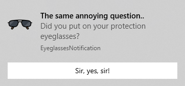

# EyeglassesNotification :eyeglasses:

## Description :framed_picture:

**EyeglassesNotification** is a `C++` application built to remember, on computer startup, **wearing the protection eyeglasses** by sending a *Windows* notification. A screenshot of the result notification is shown below.

## Setup :wrench:

1. **clone** this repository into a fixed (installation) location
2. **replace** the line starting with `#error` from `headers/Configuration.h` with the absolute path to the image used in the notification (the standard one, namely the `resources/image.png`, or one of yours)
3. *change the configuration (displayed text and delays) from the same file (optional, at your own latitude)*
4. *install `nmake` (optional, only if it is missing from your system)*
5. **run** `nmake all` from command line for building the project and scheduling the application

## Resources :books:

| Name                 | Description                                                                    | Link                                                             | 
|----------------------|--------------------------------------------------------------------------------|------------------------------------------------------------------|
| **WinToast library** | `C++` library for integration of the toast notifications from *Windows 8 / 10* | [Github repository](https://github.com/mohabouje/WinToast)       |
| **eyeglasses image** | image used in the sample notification (from screenshot)                        | [FlatIcon](https://www.flaticon.com/free-icon/sunglasses_399773) |
